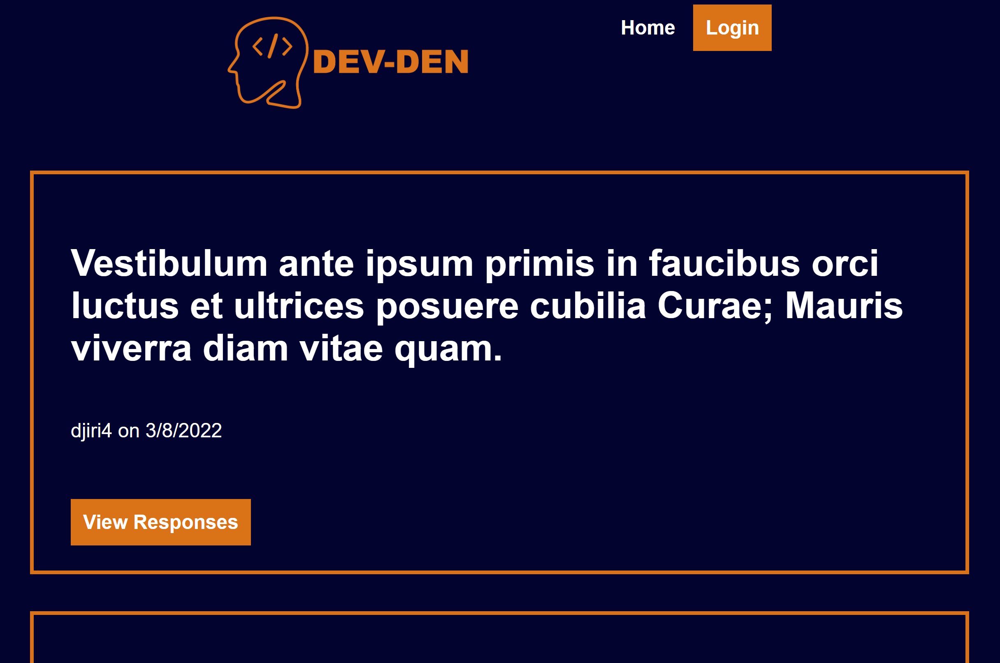
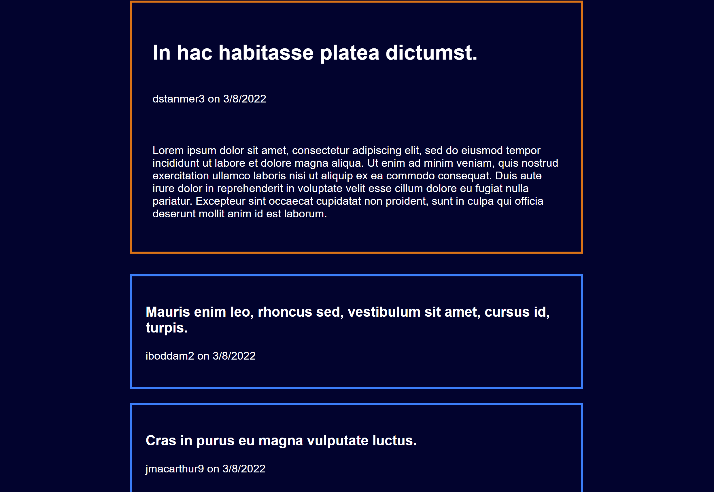

  # Dev-Den

  ## Table of Contents:

  ---
  * [Description](#description)
  * [Installation](#installation)  
  * [Usage](#usage)  
  * [Credits](#credits)    
  * [Tests](#tests)  
  * [Questions](#questions)  

  ## Description

  ---
  This Web application is a questions forum for developers to ask code related questions and other users can answer the question in the comments section. Anyone can view the questions and comments but to make a post or comment a user must create an account or log in to their account.

  ## Installation:

  ---
  To install all necessary dependencies for this program,
  open the console and run the following command:  
  ```npm i```

  ## Usage

  ---
  Users make use of this full stack application by signing in to the page with an email and password which is encrypted on the backend. Once logged in a user can create posts and comments or edit and delete them aswell and all changes are added to the database so that other users see the changes. Users cannot use any vulgar speech aswell as we have curse words banned and filtered out to censor them.

  ### Homepage Image:
  
  ### Comments page Image:
  

  ## Contribution

  ---
  ### Collaborators
  - Tristan Crain

    Github: https://github.com/tcrain96

    Email: tristan.crain@outlook.com

  - Rochelle Younger

    Github: https://github.com/RochelleYounger

    Email: regnuoy321@gmail.com

  - Jonathan Nickpor

    Github: https://github.com/nickporjonathan

    Email: nickporjonathan@gmail.com

  - Jacob Liberty

    Github: https://github.com/JacobGit3

    Email: jacob.tobin.liberty@gmail.com

  ### Assets and Libraries
  - mysql
  - Heroku
  - Express
  - dotenv
  - bcrypt
  - handlebars
  - node
  - sequelize
  - bad-words

  ## Tests

  ---
  To test this application run this command in the console:  
  ```npm run seeds, npm start```
  
  Link to deployed application on Heroku:

  https://obscure-basin-64488.herokuapp.com/

  ## Questions

  ---
  For any questions feel free to reach out through the following contacts:  

  Email: tristan.crain@outlook.com
  Github: https://github.com/tcrain96
